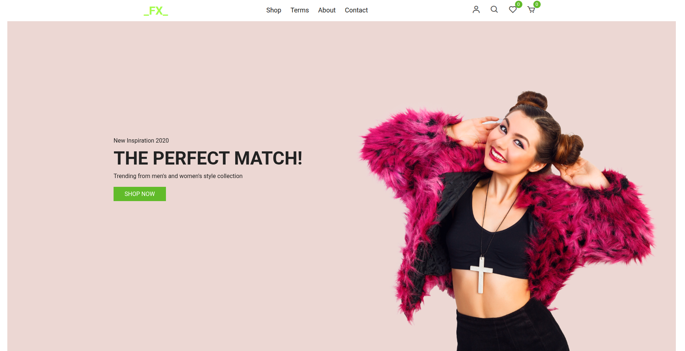

# E-commerce-website

visit: https://FaysalMahmudSajan.github.io/E-commerce-website/ 

### Project

A simple web development project built with **HTML, CSS, and JavaScript**.  
This repository contains multiple pages and assets for a basic e-commerce style website.

##  Project Structure
- **index.html** → Home page  
- **about.html** → About us page  
- **contact.html** → Contact page  
- **login.html** → Login page  
- **signup.html** → Signup page  
- **product.html** → Product listing page  
- **productDetails.html** → Product details page  
- **cart.html** → Shopping cart page  
- **term.html** → Terms & conditions page  

### Assets
- **css/** → Stylesheets  
- **js/** → JavaScript files  
- **images/** → Project images  

## Features
- Multi-page website layout  
- User authentication pages (login & signup)  
- Product listing and details view  
- Shopping cart functionality (basic structure)  
- Responsive design with CSS  

## Technologies Used
- HTML5  
- CSS3  
- JavaScript  

